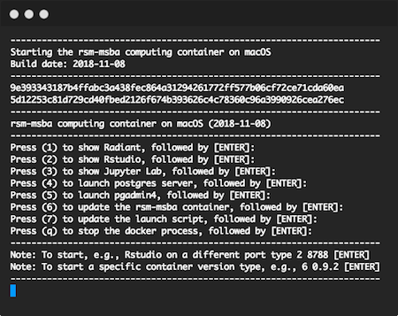

## Installing the RSM-MSBA computing environment on macOS

Please follow the instructions below to install the computing environment we will use in the MSBA program. The environment has R, Rstudio, Python, and Jupyter lab + plus required packages pre-installed. The environment will be consistent across all students and faculty, easy to update, and also easy to remove if desired (i.e., there will *not* be dozens of pieces of software littered all over your computer).

Important: You *must* complete the installation before our first class session on 8/6 or you will not be able to work on in-class exercises!

**Step 1**: Install docker from the link below and make sure it is running. You will know it is running if you see the icon below at the top-right of your screen. If the containers in the image are moving up and down docker hasn't finished starting up yet.


https://download.docker.com/mac/stable/Docker.dmg

Optional: If you are interested, the linked video gives a brief intro to what Docker is: https://www.youtube.com/watch?v=YFl2mCHdv24

**Step 2**: Open a terminal and copy-and-paste the code below.

```bash
xcode-select --install
git clone https://github.com/radiant-rstats/docker.git ~/git/docker
open ~/git/docker
~/git/docker/launch-mac.command
```

This step will start up a script that will finalize the installation of the computing envionrment. The first time you run this script it will download the latest version of the computing environment. Wait for the container to download and follow any prompts. Once the download is complete you should see a menu as in the screen shot below. You can press 2 (and Enter) to start Rstudio. Press 3 (and Enter) to start Jupyter Lab. Press q to quit. For Rstudio the username and password are both "rstudio". For Jupyter the password is "jupyter"



**Step 3**: Create a shortcut to `launch-mac.command` on your Desktop so you can "fire up" the container in the future.
